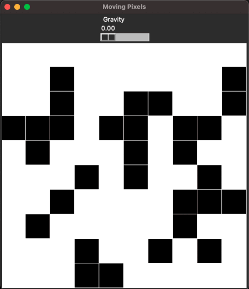

```{r setup, include=FALSE}
knitr::opts_chunk$set(echo = TRUE)
```

```{css, echo=FALSE}
.contact-box {
  position: relative;
  border: 2px solid lightgrey;
  padding: 20px;
  margin-bottom: 20px;
  border-radius: 10px;
  background-color: #f9f9f9;
}

.contact-wrapper {
  display: flex;
  flex-direction: column;
  align-items: center;
}

.contact-text {
  flex-grow: 1;
}

.link {
  text-decoration: none;
  color: #007bff;
}

.link:hover {
  text-decoration: underline;
}

.date {
  position: absolute;
  top: 10px;
  right: 10px;
  font-weight: bold;
  padding-left: 10px; /* Add left padding to separate the year from the text */
}

h2 {
  margin-bottom: 10px;
  font-size: 1.3em;
  margin-right: 50px; /* Add right margin to separate the title from the year */
}

p {
  margin-bottom: 0;
}

/* Custom CSS for the table of contents */
.tocify-item {
  display: block;
  text-indent: 0em;
  padding-right: 0em;
}

.tocify-item .tocify-header1 {
  display: inline-block;
  text-indent: 0;
  padding-left: 0;
}

.tocify-item .tocify-header2 {
  display: inline-block;
  text-indent: 0;
  padding-left: 0;
}

.tocify-item .tocify-header2 > span {
  display: inline-block;
  text-indent: 0;
  padding-left: 0;
}

.tocify-item.active {
  background-color: rgba(92, 184, 92, 0.2); /* Green with 50% transparency */
  color: rgba(92, 184, 92, 0.5);
}

.tocify-item:hover {
  background-color: rgba(100, 149, 237, 0.5); /* Light blue with transparency */
  color: #ffffff;
}

/* Add or modify the following CSS in your existing CSS code */

.tocify-item.active:hover {
  background-color: rgba(92, 184, 92, 0.7); /* Slightly transparent version of the active color */
  color: #ffffff;
}

```


This page will house projects I've done, as well as projects I'm working on

# **Gravity Chamber**

<div class="contact-wrapper contact-box">
<div class="left">
  
</div>
<div class="contact-text">
<h2><a href="https://github.com/shaunporwal/gravitychamber" class="link">Gravity Chamber Python Code</a></h2>
<span class="date">2023</span>
</div>
</div>

# **Python Package: dcurves**

<div class="contact-wrapper contact-box">
<div class="contact-text">
<h2><a href="https://github.com/MSKCC-Epi-Bio/dcurves" class="link">Decision Curve Analysis Python Package</a></h2>
<span class="date">2023</span>
<p> 
Diagnostic and prognostic models are typically evaluated with measures of accuracy that do not address clinical consequences. Decision-analytic techniques allow assessment of clinical outcomes, but often require collection of additional information that may be cumbersome to apply to models that yield continuous results. Decision Curve Analysis is a method for evaluating and comparing prediction models that incorporates clinical consequences, requiring only the data set on which the models are tested, and can be applied to models that have either continuous or dichotomous results. The dca function performs decision curve analysis for binary and survival outcomes. Review the DCA tutorial (towards the bottom) for a detailed walk-through of various applications. Also, see www.decisioncurveanalysis.org for more information.
</p>
</div>
</div>

# **Sites**

<div class="contact-wrapper contact-box">
<div class="contact-text">
<h2><a href="https://mskcc-epi-bio.github.io/decisioncurveanalysis/" class="link">http://decisioncurveanalysis.org</a></h2>
<span class="date">2023</span>
<p> I made this site for my boss' statistical method 'Decision Curve Analysis'. This mean is used to evaluate prediction models, molecular markers, and tests, based on clinical consequences.</p>
</div>
</div>

<div class="contact-wrapper contact-box">
<div class="contact-text">
<span class="date">2023</span>
<h2><a href="https://mishkanholdingsllc.org" class="link">Site for UN NGO (1)</a></h2>
<h2><a href="https://politicalaesthetics.github.io" class="link">Site for UN NGO (2)</a></h2>
<p> I made these sites for my contacts at the UN running NGOs. These are simple sites that I'm iterating on as necessary, and I do this pro bono to help out those who are dedicating themselves to noble causes. </p>
</div>
</div>


