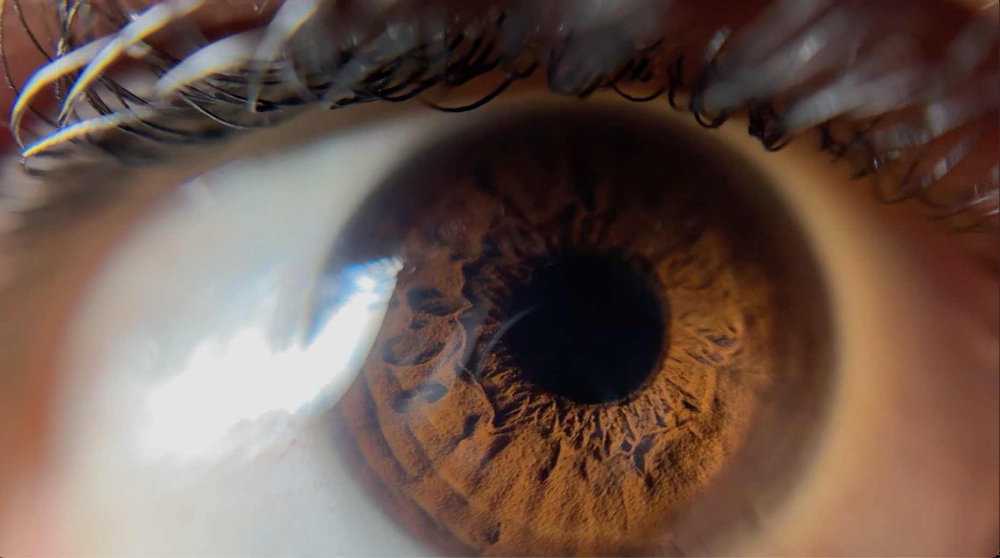

::: {.model-gallery aria-label="3D objects"}
::: {.model-card}
<model-viewer
  src="media/heron.glb"
  camera-controls
  auto-rotate
  shadow-intensity="1"
  exposure="1"
  alt="3D heron model">
</model-viewer>

Heron
:::

::: {.model-card}
<model-viewer
  src="media/nft_monkey.glb"
  camera-controls
  auto-rotate
  shadow-intensity="1"
  exposure="1"
  alt="3D monkey model">
</model-viewer>

Monkey
:::

::: {.model-card}
<model-viewer
  src="media/banana_upright2.glb"
  camera-controls
  auto-rotate
  camera-target="-0.16m 0m 0.88m"
  camera-orbit="45deg 75deg 8m"
  shadow-intensity="1"
  exposure="1"
  alt="3D banana model laying flat">
</model-viewer>

Banana Laying Flat
:::
:::

::: {.image-feature}
{fig-alt="iPhone macro photo of an eye"}

Shaun's right eye
:::
